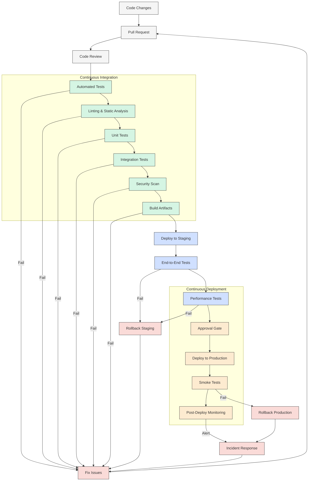

# Bifrost CI/CD Pipeline

This document outlines the Continuous Integration and Continuous Deployment (CI/CD) pipeline for the Bifrost system.

## Pipeline Overview



## CI/CD Tools and Technologies

### Source Control
- **GitHub**: Primary repository hosting
- **Branch Protection**: Requires code review, passing tests
- **Conventional Commits**: Standardized commit message format

### CI Platform
- **GitHub Actions**: Primary CI runner
- **Jenkins** (alternative): For self-hosted environments
- **Azure DevOps** (alternative): For Microsoft-centric environments

### Testing Tools
- **pytest**: Unit and integration testing
- **Behave**: Behavior-driven testing
- **Locust**: Performance testing
- **pytest-cov**: Code coverage analysis

### Code Quality
- **Black**: Python code formatting
- **isort**: Import sorting
- **flake8**: Style guide enforcement
- **mypy**: Static type checking
- **Bandit**: Security vulnerability scanning
- **SonarQube**: Code quality and security analysis

### Build Tools
- **Poetry**: Dependency management and packaging
- **Docker**: Containerization platform
- **Docker Compose**: Multi-container definition

### Deployment Tools
- **Terraform**: Infrastructure as code
- **Ansible**: Configuration management
- **Kubernetes**: Container orchestration
- **Helm**: Kubernetes package management

### Monitoring and Logging
- **Prometheus**: Metrics collection
- **Grafana**: Metrics visualization
- **ELK Stack**: Log management
- **Sentry**: Error tracking
- **Datadog** (alternative): Unified monitoring platform

## CI Pipeline Details

### 1. Code Commit and Pull Request
- Developer commits code to feature branch
- Pull request is created when feature is ready
- PR template ensures proper documentation
- Automatic assignment of reviewers

### 2. Code Review
- At least one required approver
- Automated comments on code style issues
- Review checklist enforced

### 3. Linting and Static Analysis
```yaml
# Example GitHub Actions workflow step
lint:
  runs-on: ubuntu-latest
  steps:
    - uses: actions/checkout@v3
    - name: Set up Python
      uses: actions/setup-python@v4
      with:
        python-version: '3.10'
    - name: Install dependencies
      run: |
        python -m pip install --upgrade pip
        pip install poetry
        poetry install
    - name: Lint with flake8
      run: poetry run flake8 .
    - name: Check formatting with black
      run: poetry run black --check .
    - name: Check imports with isort
      run: poetry run isort --check .
    - name: Type check with mypy
      run: poetry run mypy .
```

### 4. Unit and Integration Tests
```yaml
# Example GitHub Actions workflow step
test:
  runs-on: ubuntu-latest
  steps:
    - uses: actions/checkout@v3
    - name: Set up Python
      uses: actions/setup-python@v4
      with:
        python-version: '3.10'
    - name: Install dependencies
      run: |
        python -m pip install --upgrade pip
        pip install poetry
        poetry install
    - name: Run unit tests
      run: poetry run pytest tests/unit/ --cov=bifrost
    - name: Run integration tests
      run: poetry run pytest tests/integration/
    - name: Upload coverage reports
      uses: codecov/codecov-action@v3
```

### 5. Security Scanning
```yaml
# Example GitHub Actions workflow step
security:
  runs-on: ubuntu-latest
  steps:
    - uses: actions/checkout@v3
    - name: Set up Python
      uses: actions/setup-python@v4
      with:
        python-version: '3.10'
    - name: Install dependencies
      run: |
        python -m pip install --upgrade pip
        pip install poetry bandit safety
        poetry install
    - name: Run security checks with bandit
      run: poetry run bandit -r bifrost/
    - name: Check for vulnerable dependencies
      run: poetry run safety check
```

### 6. Build Artifacts
```yaml
# Example GitHub Actions workflow step
build:
  runs-on: ubuntu-latest
  needs: [lint, test, security]
  steps:
    - uses: actions/checkout@v3
    - name: Set up Python
      uses: actions/setup-python@v4
      with:
        python-version: '3.10'
    - name: Install build dependencies
      run: |
        python -m pip install --upgrade pip
        pip install poetry
    - name: Build package
      run: poetry build
    - name: Build Docker image
      uses: docker/build-push-action@v4
      with:
        context: .
        push: false
        tags: bifrost:${{ github.sha }}
        file: ./Dockerfile
    - name: Save artifacts
      uses: actions/upload-artifact@v3
      with:
        name: bifrost-artifacts
        path: |
          dist/
          docker-image.tar
```

## CD Pipeline Details

### 1. Deploy to Staging
```yaml
# Example GitHub Actions workflow step
deploy-staging:
  runs-on: ubuntu-latest
  needs: [build]
  environment:
    name: staging
  steps:
    - uses: actions/checkout@v3
    - name: Download artifacts
      uses: actions/download-artifact@v3
      with:
        name: bifrost-artifacts
    - name: Configure AWS credentials
      uses: aws-actions/configure-aws-credentials@v2
      with:
        aws-access-key-id: ${{ secrets.AWS_ACCESS_KEY_ID }}
        aws-secret-access-key: ${{ secrets.AWS_SECRET_ACCESS_KEY }}
        aws-region: us-west-2
    - name: Deploy to staging
      run: |
        # Deploy scripts or Terraform apply
        ./scripts/deploy_staging.sh
```

### 2. End-to-End and Performance Tests
```yaml
# Example GitHub Actions workflow step
e2e-tests:
  runs-on: ubuntu-latest
  needs: [deploy-staging]
  steps:
    - uses: actions/checkout@v3
    - name: Set up Python
      uses: actions/setup-python@v4
      with:
        python-version: '3.10'
    - name: Install dependencies
      run: |
        python -m pip install --upgrade pip
        pip install poetry
        poetry install
    - name: Run E2E tests
      run: poetry run behave tests/e2e/
    - name: Run performance tests
      run: poetry run locust -f tests/performance/locustfile.py --headless -u 50 -r 10 -t 5m
```

### 3. Production Deployment
```yaml
# Example GitHub Actions workflow step
deploy-production:
  runs-on: ubuntu-latest
  needs: [e2e-tests]
  environment:
    name: production
    url: https://bifrost.example.com
  steps:
    - uses: actions/checkout@v3
    - name: Download artifacts
      uses: actions/download-artifact@v3
      with:
        name: bifrost-artifacts
    - name: Configure AWS credentials
      uses: aws-actions/configure-aws-credentials@v2
      with:
        aws-access-key-id: ${{ secrets.AWS_ACCESS_KEY_ID }}
        aws-secret-access-key: ${{ secrets.AWS_SECRET_ACCESS_KEY }}
        aws-region: us-west-2
    - name: Deploy to production
      run: |
        # Production deployment script
        ./scripts/deploy_production.sh
    - name: Run smoke tests
      run: ./scripts/smoke_tests.sh
    - name: Verify deployment
      run: |
        # Monitor deployment metrics for 5 minutes
        ./scripts/verify_deployment.sh
```

## Environment Configuration

### Environment Variables and Secrets
- Stored securely in GitHub Secrets or equivalent
- Different sets for development, staging, and production
- Rotation policy for sensitive credentials
- No hardcoded secrets in code or configuration files

### Infrastructure as Code
- All environments defined in Terraform
- Environment-specific variables stored in separate state files
- Modules for reusable components
- Remote state storage with locking

### Configuration Management
- Application configuration stored in environment variables
- Environment-specific configuration files
- Feature flags for phased rollout
- A/B testing capabilities

## Deployment Strategies

### Blue-Green Deployment
- Duplicate production environment
- Deploy to inactive environment
- Run tests and verification
- Switch traffic when ready
- Easy rollback by switching back

```
# Simplified procedure
1. Deploy version 2.0 to Green environment
2. Run tests on Green environment
3. Update load balancer to route to Green
4. Monitor for issues
5. If successful, Blue becomes standby for next release
6. If issues, switch back to Blue
```

### Canary Releases
- Release to a small percentage of users
- Monitor for issues
- Gradually increase percentage
- Roll back if problems detected

```
# Simplified procedure
1. Deploy version 2.0 alongside version 1.0
2. Route 5% of traffic to version 2.0
3. Monitor metrics and errors
4. If acceptable, increase to 20%, then 50%, then 100%
5. If issues, route traffic back to version 1.0
```

### Feature Flags
- Deploy code but keep features disabled
- Enable features selectively
- Target specific user groups
- Disable problematic features without deployment

## Rollback Procedures

### Automatic Rollbacks
- Triggered by failed smoke tests
- Triggered by error rate thresholds
- Reverts to last known good deployment
- Alerts team of failure

### Manual Rollbacks
- Emergency procedure for critical issues
- Accessible through deployment dashboard
- Requires appropriate authorization
- Logs reason for rollback

## Observability and Monitoring

### Pre-deployment Checks
- Service health checks
- Database migration readiness
- Storage availability
- Third-party service status

### Post-deployment Monitoring
- Error rate tracking
- Performance metrics
- User experience metrics
- Business metrics
- Automated alerts for anomalies

## Security Practices

### Dependency Scanning
- Regular vulnerability scanning
- Automatic updates for non-breaking patches
- Notifications for major vulnerabilities
- Software Bill of Materials (SBOM) generation

### Secret Management
- No secrets in version control
- Secrets injected at deployment time
- Regular rotation of credentials
- Principle of least privilege

### Compliance Checks
- Code scanning for compliance issues
- License compatibility verification
- Privacy regulation compliance
- Industry-specific requirements

## CI/CD Pipeline Metrics

### Pipeline Health
- Build success rate
- Average build time
- Test coverage
- Security findings

### Deployment Metrics
- Deployment frequency
- Lead time for changes
- Change failure rate
- Mean time to recover

## Documentation and Knowledge Sharing

- Automated generation of API documentation
- Changelog from conventional commits
- Deployment runbooks
- Incident response playbooks
- Knowledge base for common issues

## Continuous Improvement

- Regular review of pipeline performance
- Post-mortem analysis of failures
- Feedback loop from production to development
- Periodic updates to tools and practices

## Appendix: GitHub Actions Workflow Example

```yaml
name: Bifrost CI/CD Pipeline

on:
  push:
    branches: [ main, develop ]
  pull_request:
    branches: [ main, develop ]

jobs:
  lint:
    runs-on: ubuntu-latest
    steps:
      - uses: actions/checkout@v3
      - name: Set up Python
        uses: actions/setup-python@v4
        with:
          python-version: '3.10'
      - name: Install dependencies
        run: |
          python -m pip install --upgrade pip
          pip install poetry
          poetry install
      - name: Lint with flake8
        run: poetry run flake8 .
      - name: Check formatting with black
        run: poetry run black --check .
      - name: Check imports with isort
        run: poetry run isort --check .
      - name: Type check with mypy
        run: poetry run mypy .

  test:
    runs-on: ubuntu-latest
    steps:
      - uses: actions/checkout@v3
      - name: Set up Python
        uses: actions/setup-python@v4
        with:
          python-version: '3.10'
      - name: Install dependencies
        run: |
          python -m pip install --upgrade pip
          pip install poetry
          poetry install
      - name: Run unit tests
        run: poetry run pytest tests/unit/ --cov=bifrost
      - name: Run integration tests
        run: poetry run pytest tests/integration/
      - name: Upload coverage reports
        uses: codecov/codecov-action@v3

  security:
    runs-on: ubuntu-latest
    steps:
      - uses: actions/checkout@v3
      - name: Set up Python
        uses: actions/setup-python@v4
        with:
          python-version: '3.10'
      - name: Install dependencies
        run: |
          python -m pip install --upgrade pip
          pip install poetry bandit safety
          poetry install
      - name: Run security checks with bandit
        run: poetry run bandit -r bifrost/
      - name: Check for vulnerable dependencies
        run: poetry run safety check

  build:
    runs-on: ubuntu-latest
    needs: [lint, test, security]
    steps:
      - uses: actions/checkout@v3
      - name: Set up Python
        uses: actions/setup-python@v4
        with:
          python-version: '3.10'
      - name: Install build dependencies
        run: |
          python -m pip install --upgrade pip
          pip install poetry
      - name: Build package
        run: poetry build
      - name: Build Docker image
        uses: docker/build-push-action@v4
        with:
          context: .
          push: false
          tags: bifrost:${{ github.sha }}
          file: ./Dockerfile
      - name: Save artifacts
        uses: actions/upload-artifact@v3
        with:
          name: bifrost-artifacts
          path: |
            dist/
            docker-image.tar

  deploy-staging:
    if: github.event_name == 'push' && github.ref == 'refs/heads/develop'
    runs-on: ubuntu-latest
    needs: [build]
    environment:
      name: staging
    steps:
      - uses: actions/checkout@v3
      - name: Download artifacts
        uses: actions/download-artifact@v3
        with:
          name: bifrost-artifacts
      - name: Deploy to staging
        run: |
          # Staging deployment script would go here
          echo "Deploying to staging..."

  e2e-tests:
    if: github.event_name == 'push' && github.ref == 'refs/heads/develop'
    runs-on: ubuntu-latest
    needs: [deploy-staging]
    steps:
      - uses: actions/checkout@v3
      - name: Set up Python
        uses: actions/setup-python@v4
        with:
          python-version: '3.10'
      - name: Install dependencies
        run: |
          python -m pip install --upgrade pip
          pip install poetry
          poetry install
      - name: Run E2E tests
        run: |
          # E2E test command would go here
          echo "Running E2E tests..."

  deploy-production:
    if: github.event_name == 'push' && github.ref == 'refs/heads/main'
    runs-on: ubuntu-latest
    needs: [build]
    environment:
      name: production
      url: https://bifrost.example.com
    steps:
      - uses: actions/checkout@v3
      - name: Download artifacts
        uses: actions/download-artifact@v3
        with:
          name: bifrost-artifacts
      - name: Deploy to production
        run: |
          # Production deployment script would go here
          echo "Deploying to production..."
      - name: Run smoke tests
        run: |
          # Smoke test script would go here
          echo "Running smoke tests..."
```
