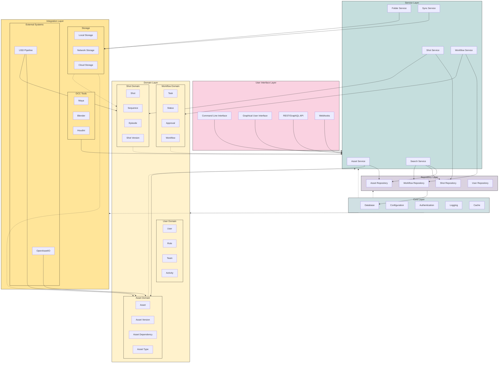

# Bifrost Architecture Diagram

This diagram illustrates the layered architecture of the Bifrost system, showing how different components interact.

## Diagram Description

### Layers

1. **User Interface Layer**
   - Command Line Interface: For script-based interaction
   - Graphical User Interface: Desktop application for visual asset management
   - REST/GraphQL API: For integration with other systems
   - Webhooks: Event-based notifications for external systems

2. **Service Layer**
   - Implements application use cases
   - Orchestrates domain objects
   - Handles cross-domain coordination
   - Manages transactions and security

3. **Domain Layer**
   - Contains core business logic and entities
   - Divided into bounded contexts (Asset, Shot, Workflow, User)
   - Implements domain-specific rules and behaviors
   - Raises domain events for important state changes

4. **Repository Layer**
   - Abstracts persistence details
   - Provides data access interfaces
   - Separates domain logic from data access
   - Supports different database implementations

5. **Core Layer**
   - Provides cross-cutting infrastructure
   - Database: Data persistence
   - Config: Configuration management
   - Auth: Authentication and authorization
   - Logging: Centralized logging
   - Cache: Performance optimization

6. **Integration Layer**
   - Connects to external systems
   - Storage: Local, network, and cloud storage
   - DCC Tools: Maya, Blender, Houdini integration
   - External Systems: OpenAssetIO, USD Pipeline

### Connection Types

- **Solid Lines (-->)**: Direct dependencies/method calls
- **Dotted Lines (-..->)**: Events or indirect dependencies

### Design Patterns

- **Repository Pattern**: For data access abstraction
- **Service Layer Pattern**: For application use cases
- **Domain-Driven Design**: For organizing business logic
- **Event-Driven Architecture**: For loose coupling between components
