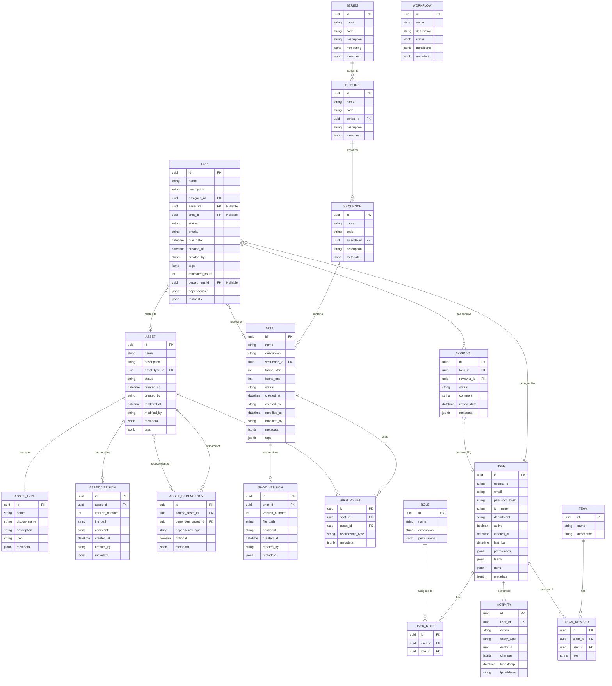

# Bifrost Database Entity Relationship Diagram

This diagram illustrates the database schema design for the Bifrost system, showing entities and their relationships.

## Diagram Description

### Entity Domains

1. **Asset Domain**
   - **ASSET**: Core asset entity with metadata
   - **ASSET_TYPE**: Classification of assets (character, prop, environment, etc.)
   - **ASSET_VERSION**: Versioning history for assets
   - **ASSET_DEPENDENCY**: Relationship between assets

2. **Shot Domain**
   - **SERIES**: Top-level organization (show, film, etc.)
   - **EPISODE**: Sub-division of series 
   - **SEQUENCE**: Group of related shots
   - **SHOT**: Individual camera shot with frame range
   - **SHOT_VERSION**: Versioning history for shots
   - **SHOT_ASSET**: Junction table linking shots to assets

3. **Workflow Domain**
   - **TASK**: Work item that can be assigned to users
   - **APPROVAL**: Review record for tasks
   - **WORKFLOW**: Definition of workflow states and transitions

4. **User Domain**
   - **USER**: System user information
   - **ROLE**: User roles with permissions
   - **USER_ROLE**: Junction table for user-role assignments
   - **TEAM**: Groups of users
   - **TEAM_MEMBER**: User membership in teams
   - **ACTIVITY**: Audit log of user actions

### Relationship Types

- **||--||**: One-to-one relationship
- **||--o{**: One-to-many relationship
- **}o--o{**: Many-to-many relationship
- **}o--||**: Many-to-one relationship
- **}o--o|**: Many-to-optional-one relationship

### Database Design Principles

1. **Entity Integrity**: All tables have primary keys (PK)
2. **Referential Integrity**: Foreign keys (FK) maintain relationships
3. **Domain Segregation**: Tables are organized by domain
4. **Metadata Flexibility**: JSONB fields allow for extensibility
5. **Audit Trails**: Creation/modification timestamps and user tracking

### Implementation Notes

- UUID primary keys for distributed systems compatibility
- JSON/JSONB for flexible schema evolution
- Created/modified timestamps for auditing
- Soft-deletion (active flag) for recoverability
