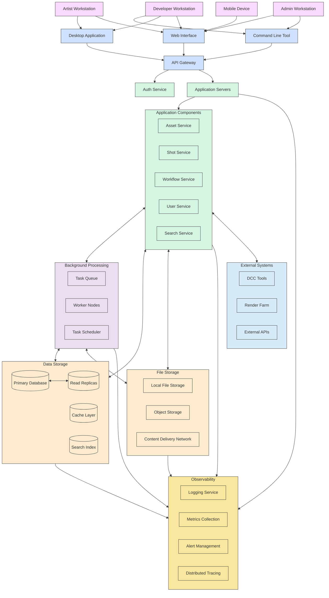

# Bifrost Infrastructure Design

This document outlines the infrastructure architecture for deploying and running the Bifrost system in various environments.

## Infrastructure Diagram

## Deployment Models

Bifrost supports several deployment models based on team size and requirements:

### 1. Single-User Development Environment

Designed for individual developers working on the Bifrost codebase:

- **Components:**
  - Local Python environment
  - SQLite database
  - Local file storage
  - Minimal monitoring

- **Hardware Requirements:**
  - Developer workstation with 16GB+ RAM
  - SSD with 100GB+ free space
  - Quad-core CPU or better

### 2. Small Team Environment (5-20 users)

Suitable for small animation teams or studios:

- **Components:**
  - Application server (1-2 instances)
  - PostgreSQL database with basic replication
  - NAS or SAN storage system
  - Basic monitoring and logging
  - Local authentication

- **Hardware Requirements:**
  - Application Server: 8+ CPU cores, 32GB+ RAM
  - Database Server: 4+ CPU cores, 16GB+ RAM
  - Storage: High-speed NAS with 10TB+ capacity
  - 1Gbps network minimum

### 3. Medium Studio Environment (20-100 users)

Scaled for medium-sized animation studios:

- **Components:**
  - Load-balanced application servers (3+ instances)
  - PostgreSQL database cluster with read replicas
  - Redis cache layer
  - Hybrid storage (local + cloud object storage)
  - Comprehensive monitoring and logging
  - LDAP/SSO integration

- **Hardware Requirements:**
  - Application Servers: Multiple 16+ core servers with 64GB+ RAM
  - Database Cluster: Primary with 8+ cores, 32GB+ RAM; Multiple read replicas
  - Storage: Enterprise NAS/SAN with 50TB+ capacity + cloud storage
  - 10Gbps network backbone

### 4. Enterprise Environment (100+ users)

Built for large studios or distributed teams:

- **Components:**
  - Auto-scaling application server clusters
  - Geo-distributed database with sharding
  - Multi-region object storage with CDN
  - Distributed cache with Redis cluster
  - Advanced monitoring with predictive alerts
  - Enterprise SSO and fine-grained permissions
  - Dedicated task processing clusters

- **Hardware Requirements:**
  - Application: Auto-scaling cloud infrastructure
  - Database: Enterprise database cluster with geo-replication
  - Storage: Multi-petabyte storage systems with tiered architecture
  - Network: Redundant 40Gbps+ connections with global presence

## Cloud Deployment Options

### AWS Architecture

- **Compute:** ECS or EKS for container orchestration
- **Database:** Aurora PostgreSQL
- **Storage:** S3 for object storage, EFS for shared file systems
- **CDN:** CloudFront
- **Cache:** ElastiCache (Redis)
- **Search:** OpenSearch Service
- **Monitoring:** CloudWatch, X-Ray
- **Authentication:** Cognito with IAM

### Azure Architecture

- **Compute:** AKS or App Service
- **Database:** Azure Database for PostgreSQL
- **Storage:** Blob Storage, Azure Files
- **CDN:** Azure CDN
- **Cache:** Azure Cache for Redis
- **Search:** Azure Cognitive Search
- **Monitoring:** Azure Monitor, Application Insights
- **Authentication:** Azure Active Directory

### GCP Architecture

- **Compute:** GKE or Cloud Run
- **Database:** Cloud SQL for PostgreSQL
- **Storage:** Cloud Storage
- **CDN:** Cloud CDN
- **Cache:** Memorystore for Redis
- **Search:** Elasticsearch on GCE
- **Monitoring:** Cloud Monitoring, Cloud Trace
- **Authentication:** Firebase Authentication, Identity Platform

## Network Architecture

### Security Zones

1. **Public Zone**
   - API Gateway
   - Load Balancers
   - CDN Edge Nodes

2. **Web Application Zone**
   - Web Servers
   - API Application Servers

3. **Service Zone**
   - Application Services
   - Background Processing

4. **Data Zone**
   - Databases
   - Cache Servers
   - Search Indexes

5. **Storage Zone**
   - File Storage Systems
   - Object Storage

### Network Security Measures

- **API Gateway:** Rate limiting, WAF, DDoS protection
- **VPC/Network Segmentation:** Isolate different security zones
- **Encryption:** TLS for all traffic, at-rest encryption for storage
- **Access Control:** Least privilege principle, network ACLs
- **VPN:** Secure remote access for administrators

## Scaling Strategies

### Horizontal Scaling

- **Stateless Services:** Add more application server instances
- **Background Processing:** Add more worker nodes
- **Read Scaling:** Add database read replicas

### Vertical Scaling

- **Database Primary:** Increase compute and memory resources
- **File Processing Nodes:** GPU acceleration for rendering/processing

### Data Partitioning

- **Sharding:** Partition database by project or time period
- **Storage Tiering:** Move less accessed data to cheaper storage

## High Availability & Disaster Recovery

### High Availability Design

- **Multi-AZ Deployment:** Distribute across availability zones
- **Load Balancing:** Route traffic to healthy instances
- **Database Clustering:** Automated primary failover
- **Redundant Storage:** Data replication across zones

### Disaster Recovery

- **Backup Strategy:**
  - Database: Daily full backups, continuous WAL archiving
  - Assets: Versioned object storage with cross-region replication
  - Configuration: Infrastructure as Code repositories

- **Recovery Objectives:**
  - RPO (Recovery Point Objective): < 15 minutes
  - RTO (Recovery Time Objective): < 4 hours for critical systems

- **DR Procedures:**
  - Regular DR testing with automated recovery
  - Documented runbooks for manual interventions
  - Cross-region replication for critical data

## Resource Estimation

| Component | Small Team | Medium Studio | Enterprise |
|-----------|------------|---------------|------------|
| CPU Cores | 16-32      | 64-128        | 256+       |
| Memory    | 64-128 GB  | 256-512 GB    | 1 TB+      |
| Storage   | 10-50 TB   | 100-500 TB    | 1 PB+      |
| Network   | 1 Gbps     | 10 Gbps       | 40+ Gbps   |
| Monthly Cost* | $1-3K   | $5-15K        | $25K+      |

*Cloud deployment estimated costs, varies by provider and region

## Implementation Recommendations

1. **Start Small:** Begin with the simplest deployment that meets immediate needs
2. **Infrastructure as Code:** Use Terraform/CloudFormation from the beginning
3. **Containerization:** Containerize all components for consistency
4. **Monitoring First:** Implement comprehensive monitoring before scaling
5. **Automation:** Automate deployment, scaling, and recovery processes
