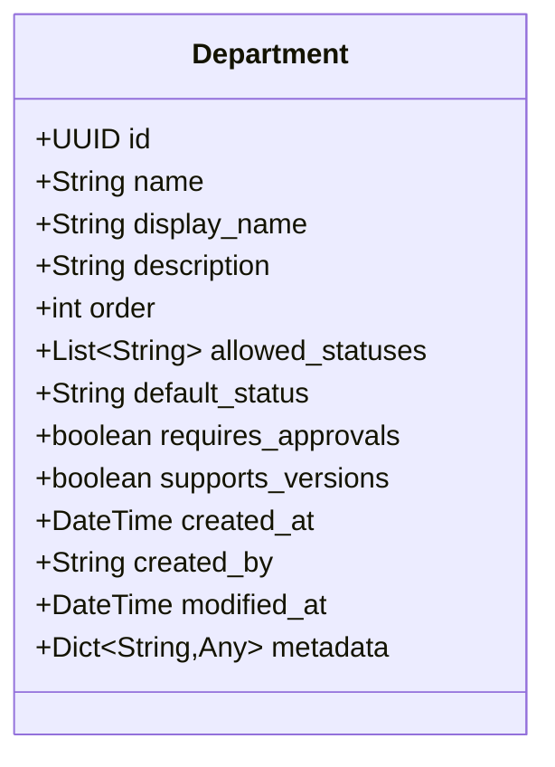
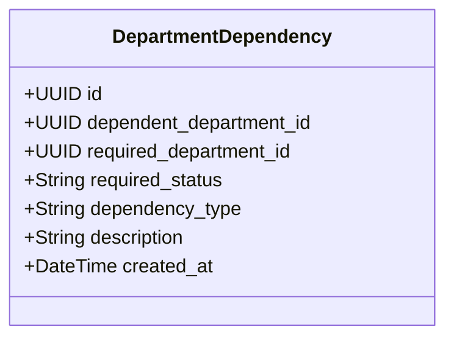
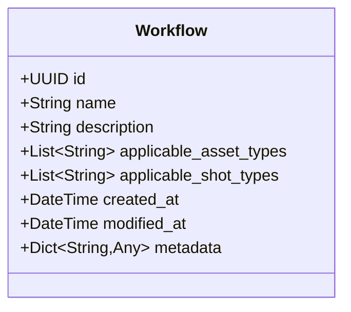
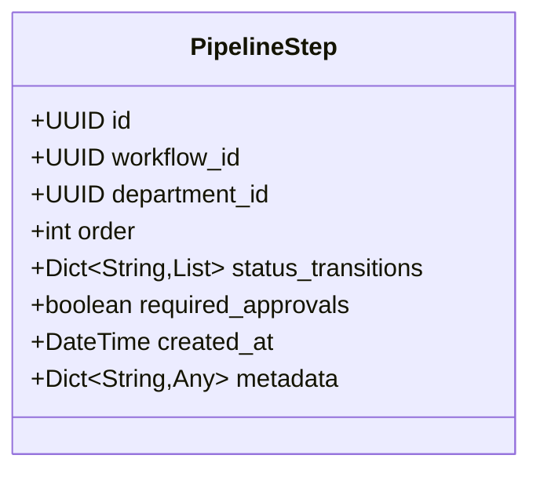
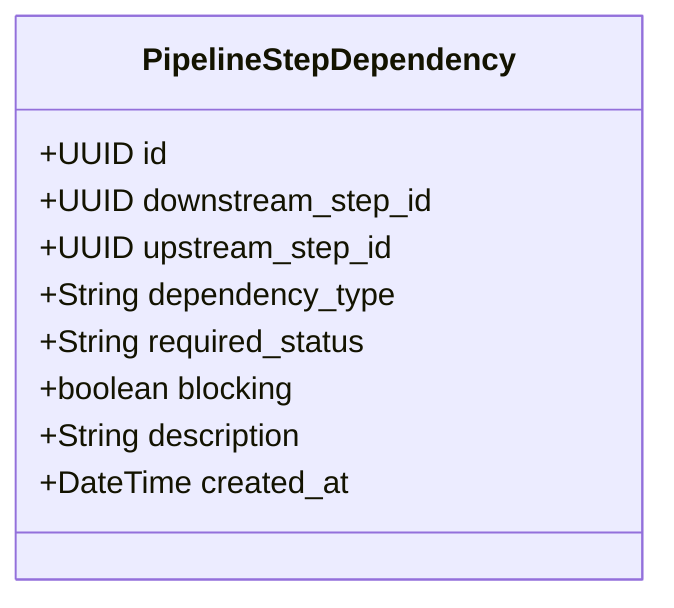
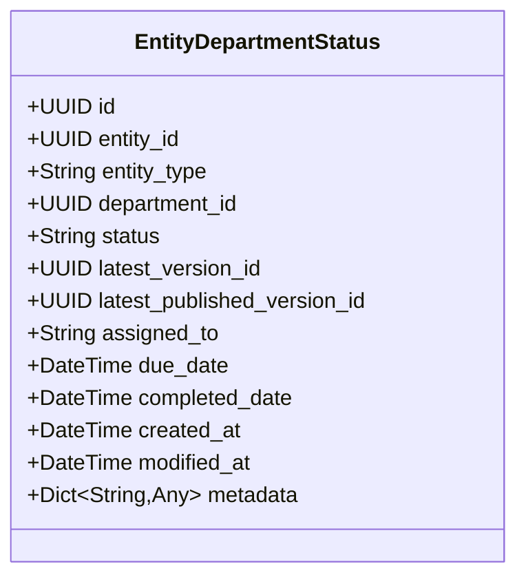

# Department Domain Model

This document outlines the domain model for departments and pipeline steps in the Bifrost Animation Asset Management System.

## Overview

The Department domain is responsible for:
1. Defining production departments (modeling, rigging, animation, etc.)
2. Managing department dependencies and sequences
3. Tracking department status for assets and shots
4. Organizing tasks within departments
5. Defining and enforcing workflows through pipeline steps

## Core Entities

### Department

Represents a functional department in the animation production pipeline.

### Department Dependency

Defines dependencies between departments in the production pipeline.

### Workflow

Defines a production workflow that can be applied to assets or shots.

### Pipeline Step

Represents a specific step in a workflow involving a department.

### Pipeline Step Dependency

Defines dependencies between pipeline steps, establishing upstream and downstream relationships.

### Entity Department Status

Tracks the status of a department for a specific asset or shot.

## Relationships

- **Department to DepartmentDependency**: A department can have multiple dependencies on other departments
- **Workflow to PipelineStep**: A workflow consists of multiple pipeline steps
- **Department to PipelineStep**: A department is used in one or more pipeline steps
- **PipelineStep to PipelineStepDependency**: Pipeline steps can have upstream and downstream dependencies
- **Department to EntityDepartmentStatus**: A department's status is tracked for assets and shots
- **Asset/Shot to EntityDepartmentStatus**: Assets and shots have status tracked for multiple departments
- **Department to Task**: Tasks can be associated with departments
- **PipelineStep to Task**: Tasks can be part of specific pipeline steps

## Statuses and Workflows

### Department Statuses

Standard department statuses include:
- `not_started`: Work has not yet begun
- `in_progress`: Work is currently being performed
- `review`: Work is complete and awaiting review/approval
- `published`: Work has been approved and published
- `approved`: Final approval granted

### Dependency Types

- `blocking`: The dependent department cannot proceed until the required department reaches a specific status
- `non-blocking`: The dependent department can proceed, but should be aware of the required department's status
- `reference`: The dependent department uses the required department's output as reference

## Domain Rules

1. **Department Order**: Departments have a logical order in the production pipeline
2. **Status Progression**: Department statuses typically progress in a defined sequence
3. **Dependency Enforcement**: Blocking dependencies prevent work from starting on dependent departments
4. **Workflow Applicability**: Workflows are applicable to specific asset or shot types
5. **Pipeline Step Sequence**: Pipeline steps have a defined order within a workflow
6. **Version Tracking**: Department work is tracked through versions for both assets and shots

## Use Cases

1. **Define Production Pipeline**: Create departments and establish their dependencies
2. **Create Workflow**: Define a sequence of pipeline steps for a specific production type
3. **Track Asset/Shot Progress**: Monitor the status of each department's work on assets and shots
4. **Manage Task Dependencies**: Ensure tasks are completed in the appropriate sequence
5. **Enforce Workflow Rules**: Prevent work from proceeding until prerequisites are met
